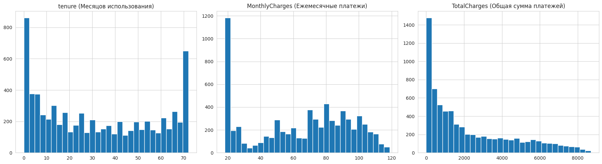
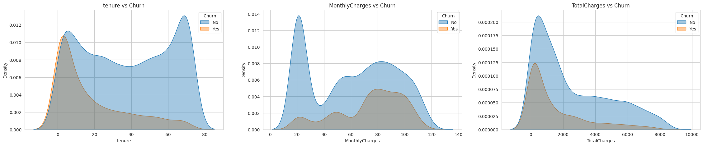
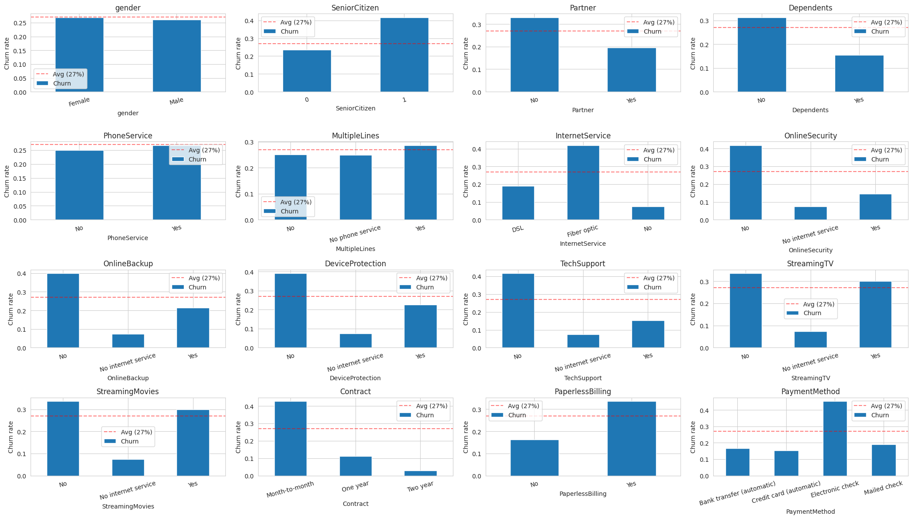
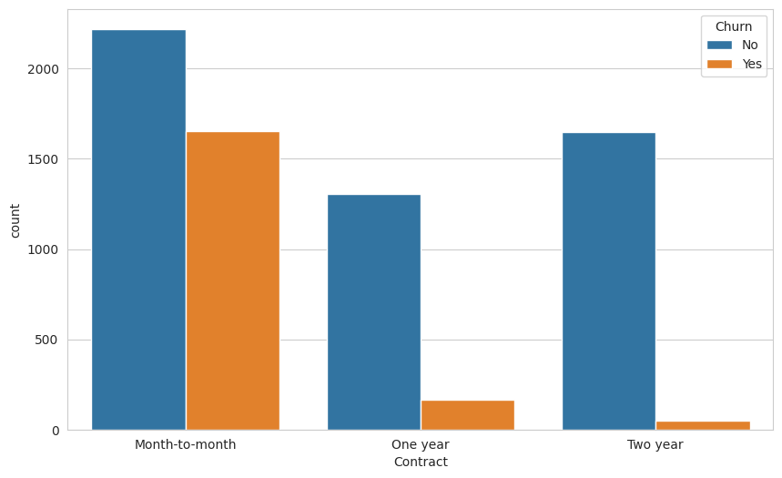
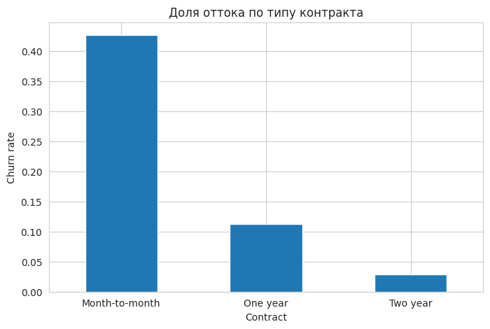
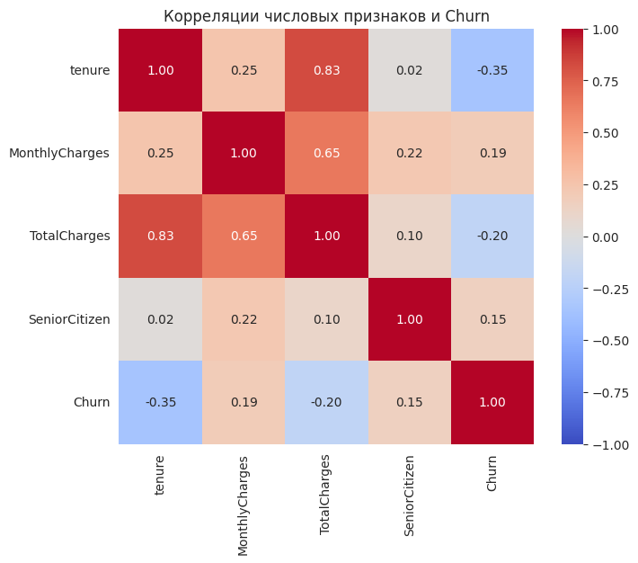
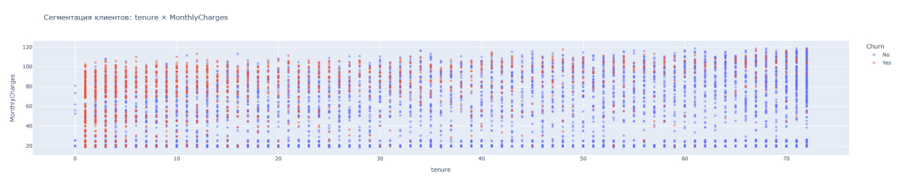
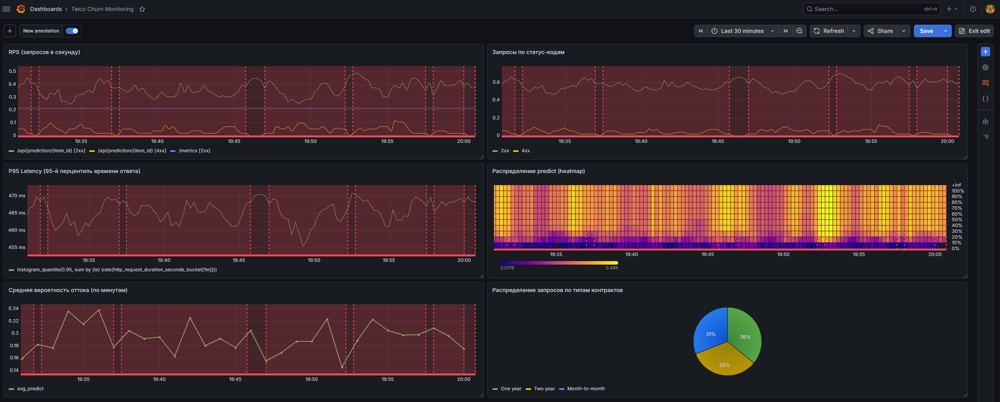

# Telco Customer Churn Prediction

End-to-end ML-проект по предсказанию оттока клиентов телеком-компании с полным циклом MLOps:
EDA -> эксперименты с моделями и фичами -> трекинг в MLflow -> деплой модели как FastAPI-сервиса -> мониторинг.

## Стек

**Языки и фреймворки:** Python 3.11, pandas, numpy, scikit-learn, CatBoost, MLflow, Optuna, autofeat, mlxtend, FastAPI, Docker, Docker Compose, Prometheus, Grafana, PostgreSQL.

**Задача:** бинарная классификация (отток клиента: Yes/No). Дисбаланс классов 73/27.

**Датасет:** Telco Customer Churn - 7043 объекта, 20 признаков (числовые + категориальные).

## Структура проекта

```
my_proj
├── data/                     # Исходные и очищенные данные (не коммитятся)
├── eda/                      # Разведочный анализ
│   ├── eda.ipynb
│   └── *.png                 # Графики EDA
├── research/                 # Эксперименты с моделями
│   ├── research.ipynb
│   ├── model_runs.png
│   ├── model_versions.png
│   └── MLmodel
├── mlflow/                   # Фреймворк трекинга
│   └── start_mlflow.sh
├── services/
│   ├── ml_service/           # FastAPI-сервис
│   │   ├── main.py
│   │   ├── api_handler.py
│   │   ├── requirements.txt
│   │   └── Dockerfile
│   └── models/               # Модель и скрипт выгрузки
│       ├── get_model.py
│       └── model.pkl         # gitignored
├── .gitignore
├── README.md
└── requirements.txt
```

## Запуск проекта

### 1. Клонирование и окружение

```bash
git clone https://github.com/walenokqq/telco-churn.git
cd telco-churn

python3 -m venv .venv_my_proj
source .venv_my_proj/bin/activate

pip install -r requirements.txt
```

### 2. Подготовка данных

Положите файл `WA_Fn-UseC_-Telco-Customer-Churn.csv` в папку `data/`.
Запустите ноутбук `eda/eda.ipynb` для очистки и сохранения `data/telco_churn_clean.pkl`.

### 3. Запуск MLflow

```bash
cd mlflow
sh start_mlflow.sh
```

### 4. Запуск экспериментов

Откройте ноутбук `research/research.ipynb` и последовательно запустите ячейки.

## Результаты EDA

- Датасет содержит 7043 клиента и 21 признак. Целевая переменная - Churn (Yes/No), 27% оттока.
- Очистка: колонка TotalCharges приведена из строки в float, 11 битых значений (клиенты с tenure=0) заполнены нулями.
- Самые сильные предикторы оттока: тип контракта, тип интернета, способ оплаты, защитные допуслуги, срок обслуживания (tenure).
- Шумовые признаки: gender, PhoneService.
- Портрет клиента группы риска: новичок с дорогим тарифом fiber optic, на помесячном контракте, без допуслуг защиты, оплачивает electronic check.

**Распределение числовых признаков**



**Числовые признаки vs Churn**



**Категориальные признаки vs churn rate**



**Contract vs Churn**



**Доля оттока по типу контракта**



**Корреляции числовых признаков**



**Сегментация клиентов: tenure × MonthlyCharges**



## Результаты исследования

Проведено 9 экспериментов с моделями. Все результаты залогированы в MLflow.

| Эксперимент | precision | recall | f1 | roc_auc |
|---|---|---|---|---|
| Baseline RF | 0.667 | 0.493 | 0.567 | 0.838 |
| FE sklearn (Polynomial + Bins) | 0.662 | 0.495 | 0.566 | 0.836 |
| FE autofeat | 0.681 | 0.480 | 0.563 | 0.843 |
| FS SFS forward | 0.573 | 0.480 | 0.522 | 0.790 |
| FS combined (SFS + RFE) | 0.602 | 0.473 | 0.530 | 0.809 |
| **Optuna RF (Production)** | **0.661** | **0.527** | **0.586** | 0.845 |
| CatBoost default | 0.659 | 0.493 | 0.564 | 0.847 |
| CatBoost tuned | 0.663 | 0.505 | 0.574 | 0.848 |

### Production-модель

**Алгоритм:** RandomForestClassifier с гиперпараметрами, подобранными через Optuna.

**Параметры:**
- `n_estimators`: 258
- `max_depth`: 10
- `max_features`: 0.264
- `random_state`: 42

**Препроцессинг:**
- Числовые признаки -> `StandardScaler`
- Категориальные признаки -> `TargetEncoder`

**Метрики на test:** f1=0.586, roc_auc=0.845, precision=0.661, recall=0.527

**MLflow run_id:** `57444a75c2c840238e40d2dde43af954`
**Версия в Model Registry:** Version 7, alias `@production`

### Ключевые предикторы оттока

По результатам отбора признаков (SFS, RFE, CatBoost importance) топ-3 предиктора:

1. **Contract** - тип контракта (Month-to-month клиенты уходят чаще)
2. **tenure** - срок обслуживания (новички уходят чаще ветеранов)
3. **OnlineSecurity / TechSupport** - наличие защитных услуг (клиенты без них уходят чаще)

## Выводы

- Для табличной классификации с дисбалансом классов наилучший результат показал тюненный RandomForest. CatBoost показал сопоставимый roc_auc, но немного меньший f1.
- Внешний feature engineering (PolynomialFeatures, KBinsDiscretizer, autofeat) не дал значимого прироста - RF сам ловит нелинейности через сплиты деревьев.
- Феничный отбор (SFS, RFE) не улучшил метрики, но позволил выделить 3 ключевых предиктора оттока.
- Оптимизация гиперпараметров через Optuna (TPE-sampler) дала +2% к f1 относительно baseline за 15 trials.

## ML-сервис

FastAPI-сервис, оборачивающий обученную модель оттока. Принимает признаки клиента, возвращает вероятность оттока.

### Получить модель из MLflow

```bash
# MLflow в одном терминале:
cd mlflow && sh start_mlflow.sh

# В другом:
cd services/models && python get_model.py
```

### Запуск Docker-образа

```bash
cd services/ml_service
docker build -t telco_churn_service:1 .
docker run -p 8000:8000 -v $(pwd)/../models:/models telco_churn_service:1
```

### Проверка работы

Swagger UI: `http://localhost:8000/docs`

Пример запроса `POST /api/prediction/123`:
```json
{
  "customerID": "7590-VHVEG",
  "gender": "Male",
  "SeniorCitizen": 0,
  "Partner": "Yes",
  "Dependents": "No",
  "tenure": 12,
  "PhoneService": "Yes",
  "MultipleLines": "No",
  "InternetService": "Fiber optic",
  "OnlineSecurity": "No",
  "OnlineBackup": "Yes",
  "DeviceProtection": "No",
  "TechSupport": "No",
  "StreamingTV": "Yes",
  "StreamingMovies": "No",
  "Contract": "Month-to-month",
  "PaperlessBilling": "Yes",
  "PaymentMethod": "Electronic check",
  "MonthlyCharges": 70.35,
  "TotalCharges": 845.5
}
```

Ответ: `{"item_id": 123, "predict": 0.548}` (вероятность оттока).


## Мониторинг и БД

### Архитектура
Проект разворачивается через `docker-compose` и состоит из 6 сервисов:

- **ml_service** - FastAPI-сервис предсказаний (порт 8000). Endpoints: `/api/prediction/{id}`, `/metrics`, `/docs`. При каждом запросе пишет вход/выход в БД и метрику в Prometheus.
- **requests** - генератор синтетической нагрузки, шлёт случайные POST-ы в ml_service каждые 0-5 секунд (10% - намеренно битые).
- **prometheus** - pull-мониторинг (порт 9090). Скрапит `/metrics` каждые 5 сек.
- **grafana** - дашборды (порт 3000, admin/admin).
- **database** - PostgreSQL 17 (порт хоста 5433, внутренний 5432, БД `telco_churn`, admin/admin).
- **pgadmin** - web-интерфейс БД (порт 5050).

### Структура БД
- `clients` - входные данные запроса: `id`, `ts`, `customer_id`, `tenure`, `monthly_charges`, `total_charges`, `contract`, `internet_service`, `payment_method`
- `predictions` - предсказание: `id`, `ts`, `client_id (FK → clients.id)`, `client_ts`, `predict`

### Запуск
```bash
cd services
docker compose up --build -d
```

Доступы:
- Сервис: http://localhost:8000/docs
- Prometheus: http://localhost:9090
- Grafana: http://localhost:3000 (admin/admin)
- pgAdmin: http://localhost:5050 (admin@admin.com/admin)

### Дашборд Grafana
Дашборд экспортирован в `services/grafana/dashboard.json` и содержит 6 графиков:

1. **RPS** - текущая нагрузка на сервис
2. **Запросы по статус-кодам** - доля 200/422/500
3. **P95 Latency** - 95-й перцентиль времени ответа
4. **Распределение predict (heatmap)** - тепловая карта вероятностей оттока, сдвиг плотности сигнализирует о drift
5. **Средняя вероятность оттока по минутам** - тренд из БД
6. **Распределение запросов по типам контрактов** - какие сегменты клиентов чаще запрашиваются



### Скриншоты Prometheus
В `services/prometheus/screenshots/`:
- `predictions_histogram.png` - гистограмма предсказаний
- `requests_rate.png` - частота запросов в минуту
- `error_rates.png` - 4xx/5xx ошибки

### Использованные технологии
- **ML**: scikit-learn 1.8, pandas 2.2, numpy 1.26
- **MLOps**: MLflow 2.16 (training/registry), Optuna 4.8 (HPO), CatBoost 1.2, autofeat 2.1
- **Serving**: FastAPI 0.115, uvicorn, Pydantic 2.9
- **Monitoring**: prometheus-client, prometheus-fastapi-instrumentator, Grafana
- **Storage**: PostgreSQL 17, SQLAlchemy 2.0, psycopg2
- **Infrastructure**: Docker, Docker Compose